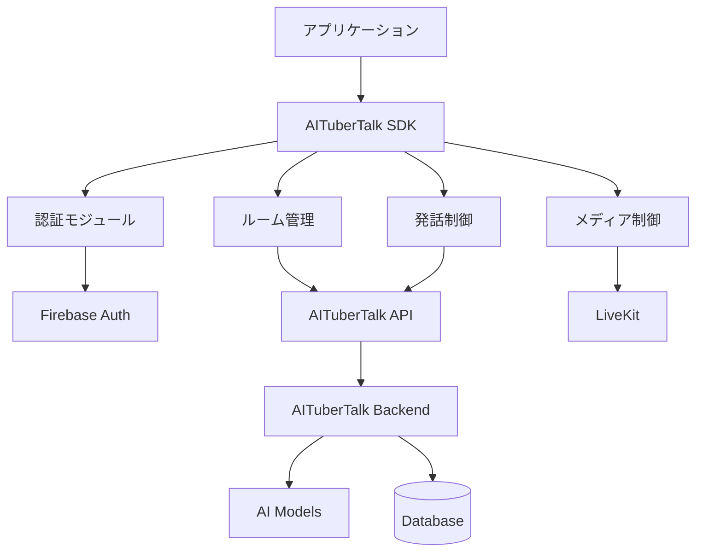

# AITuberTalk SDK

[](https://opensource.org/licenses/MIT)
[](https://www.python.org/downloads/)
[](https://www.typescriptlang.org/)
[](https://unity.com/)

AI VTuberシステムとの統合を簡単に行える、マルチプラットフォーム対応のSDKです。リアルタイム音声通信、ルーム管理、発話制御など、AI VTuberアプリケーション開発に必要な機能を包括的に提供します。

## 🌟 特徴

- **🔐 統合認証**: Firebase Authenticationによるセキュアな認証システム
- **🏠 ルーム管理**: ルームの作成、参加、管理機能
- **🎤 発話制御**: 発話権管理と音声合成機能
- **📺 メディア制御**: 音声・映像ストリームの管理
- **⚡ リアルタイム通信**: WebSocketベースの高速イベントシステム
- **🌐 マルチプラットフォーム**: Python、TypeScript/JavaScript、Unity C#対応

## 🚀 対応プラットフォーム

### 開発優先順

| プラットフォーム | 状態 | 対象開発者 | ドキュメント |
|----------------|------|-----------|-------------|
| **Python** | ✅ 完成 | AI開発者、MLエンジニア | [Python SDK](./python/README.md) |
| **TypeScript/JavaScript** | 🚧 開発予定 | Webアプリケーション開発者 | 準備中 |
| **Unity C#** | 📋 計画中 | ゲーム・VR開発者 | 準備中 |

## 📦 インストール

### Python SDK（推奨・完成済み）

```bash
pip install aitubertalk
```

### TypeScript/JavaScript SDK（開発予定）

```bash
npm install @aitubertalk/sdk
# または
yarn add @aitubertalk/sdk
```

### Unity C# SDK（計画中）

Unity Package Manager経由:
```
https://github.com/aitubertalk/sdk-unity.git
```

## 🏃‍♂️ クイックスタート

### Python SDK

```python
import asyncio
from aitubertalk import AITuberTalkClient

async def main():
    # クライアント初期化
    client = AITuberTalkClient(
        api_key='your-api-key',
        region='asia-northeast1'
    )
    
    # 認証
    await client.auth.sign_in_with_email('user@example.com', 'password')
    
    # ルーム参加
    join_result = await client.rooms.join('room-123', {
        'type': 'aituber',
        'name': 'AI Assistant',
        'aituber_config': {
            'model_id': 'gemini-pro',
            'personality': 'friendly and helpful'
        }
    })
    
    # 発話権管理
    @client.dialogue.on_floor_granted
    async def on_floor_granted(token):
        await client.dialogue.speak('こんにちは、みなさん！')
    
    await client.dialogue.request_floor()
    await client.start()

if __name__ == '__main__':
    asyncio.run(main())
```

## 📖 ドキュメント

### 📋 仕様書
- [SDK仕様書](./SDK-SPECIFICATION.md) - 全プラットフォーム共通の詳細仕様

### 🐍 Python SDK
- [Python SDK README](./python/README.md) - インストール・使用方法
- [Python SDK API リファレンス](./python/docs/) - 詳細なAPI仕様
- [Python SDK サンプル](./python/examples/) - 実用的なコード例

### 🌐 TypeScript/JavaScript SDK（開発予定）
- TypeScript SDK README - 準備中
- TypeScript SDK API リファレンス - 準備中

### 🎮 Unity C# SDK（計画中）
- Unity C# SDK README - 準備中
- Unity C# SDK API リファレンス - 準備中

## 🏗️ アーキテクチャ



## 🔧 開発環境

### 必要な環境

| プラットフォーム | 要件 |
|----------------|------|
| **Python** | Python 3.8+, asyncio |
| **TypeScript** | Node.js 18+, TypeScript 4.0+ |
| **Unity** | Unity 2022.3 LTS+, .NET Standard 2.1 |

### 開発用セットアップ

```bash
# リポジトリクローン
git clone https://github.com/aitubertalk/AITuberTalk-SDK.git
cd AITuberTalk-SDK

# Python SDK開発環境
cd python
pip install -e ".[dev]"
pytest  # テスト実行

# TypeScript SDK開発環境（準備中）
cd typescript
npm install
npm test

# Unity SDK開発環境（準備中）
# Unity Editorで開く
```

## 🎯 使用例

### AI開発者向け（Python）
- **チャットボット統合**: 既存のAIモデルをVTuberシステムに統合
- **音声対話システム**: リアルタイム音声認識・合成システムの構築
- **マルチエージェントシステム**: 複数AIの協調対話システム

### Web開発者向け（TypeScript）
- **ライブ配信プラットフォーム**: VTuberライブ配信サイトの構築
- **インタラクティブWebサイト**: AIキャラクターとの対話Webアプリ
- **リアルタイムチャット**: AI VTuberが参加するチャットシステム

### ゲーム開発者向け（Unity）
- **VRチャット**: VR空間でのAI VTuber対話
- **ゲーム内NPC**: 知的なAIキャラクターシステム
- **メタバース統合**: 仮想世界でのAI VTuber体験

## 🤝 コントリビュート

### 開発参加

1. **Issue報告**: [GitHub Issues](https://github.com/aitubertalk/AITuberTalk-SDK/issues)
2. **Pull Request**: 機能追加・バグ修正の貢献
3. **ドキュメント改善**: 使用例やガイドの追加

### 開発フロー

```bash
# フォーク & クローン
git clone https://github.com/your-username/AITuberTalk-SDK.git
cd AITuberTalk-SDK

# フィーチャーブランチ作成
git checkout -b feature/your-feature-name

# 開発・テスト・コミット
git add .
git commit -m "feat: your feature description"

# プッシュ & プルリクエスト
git push origin feature/your-feature-name
```

## 📈 ロードマップ

### Phase 1: Foundation（完了）
- [x] Python SDK実装
- [x] 基本認証システム
- [x] ルーム管理機能
- [x] 発話制御システム

### Phase 2: Web Platform（進行中）
- [ ] TypeScript/JavaScript SDK
- [ ] React/Vue.js統合サンプル
- [ ] ブラウザ最適化

### Phase 3: Game Platform（計画中）
- [ ] Unity C# SDK  
- [ ] VR対応機能
- [ ] メタバース統合

### Phase 4: Advanced Features（将来）
- [ ] 多言語音声合成
- [ ] 感情認識・表現
- [ ] リアルタイム翻訳
- [ ] 3Dアバター統合

## 🆘 サポート

### ヘルプとサポート
- **ドキュメント**: [公式ドキュメント](https://docs.aitubertalk.ai)
- **Issues**: [GitHub Issues](https://github.com/aitubertalk/AITuberTalk-SDK/issues)
- **Discussions**: [GitHub Discussions](https://github.com/aitubertalk/AITuberTalk-SDK/discussions)
- **Discord**: [開発者コミュニティ](https://discord.gg/aitubertalk)

### よくある質問
- **Q: 無料で使用できますか？**
  A: オープンソースSDKは無料です。API使用量に応じた課金があります。

- **Q: 商用利用は可能ですか？**
  A: MIT ライセンスの下で商用利用可能です。

- **Q: どのAIモデルに対応していますか？**
  A: OpenAI GPT、Google Gemini、Anthropic Claudeなど主要なモデルに対応。

## 📄 ライセンス

このプロジェクトは [MIT License](./LICENSE) の下で公開されています。

## 🙏 謝辞

- [LiveKit](https://livekit.io/) - リアルタイム通信基盤
- [Firebase](https://firebase.google.com/) - 認証・データベース
- [OpenAI](https://openai.com/) - AI モデル統合
- コミュニティの皆様 - フィードバックと貢献

---

**🎉 AITuberTalk SDK で、あなただけのAI VTuberアプリケーションを作ってみましょう！**

[](https://github.com/aitubertalk/AITuberTalk-SDK)
[](https://github.com/aitubertalk/AITuberTalk-SDK/fork)